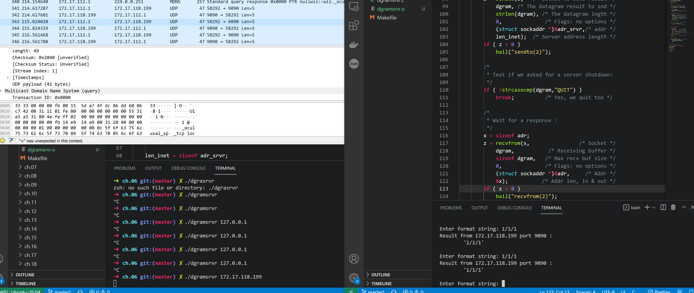

- # [[Compile examples]] 
  Check for Makefiles in each of the characters. Compile with:
  ``` make {sourcefile} Makefile
  make {sourcefile} Makefile
  ```
- # [[Testing changes across the network]]
  #+BEGIN_TIP
  To test networking between computers, WSL2 uses NAT to virtualize the connection, which means we cant use the C scripts in the local network.
  We need to download a GUI (probably not needed but makes it easier) and set up netsh rules + firewall on the port we want to test.
  Work in progress since what I tested does not work. Prob because of Avast.
  
  ```
  !Ubuntu GUI commands:
  
  sudo apt update && sudo apt -y upgrade
  sudo apt-get purge xrdp
  sudo apt install -y xrdp
  sudo apt install -y xfce4
  sudo apt install -y xfce4-goodies
  
  sudo cp /etc/xrdp/xrdp.ini /etc/xrdp/xrdp.ini.bak
  sudo sed -i 's/3389/3390/g' /etc/xrdp/xrdp.ini
  sudo sed -i 's/max_bpp=32/#max_bpp=32\nmax_bpp=128/g' /etc/xrdp/xrdp.ini
  sudo sed -i 's/xserverbpp=24/#xserverbpp=24\nxserverbpp=128/g' /etc/xrdp/xrdp.ini
  echo xfce4-session > ~/.xsession
  
  
  
  sudo nano /etc/xrdp/startwm.sh
  !comment these lines to:
  #test -x /etc/X11/Xsession && exec /etc/X11/Xsession
  #exec /bin/sh /etc/X11/Xsession
  
  !add these lines:
  # xfce
  startxfce4
  
  sudo /etc/init.d/xrdp start
  
  !Now in Windows, use Remote Desktop Connection
  localhost:3390
  
  !Then login using your Ubuntu username and password
  ```
  After setting this up, you should be able to RDP from the Windows host to :3390. 
  Now, open up powershell and do
  
  ```netsh
  netsh interface portproxy add v4tov4 listenport=3390 listenaddress=0.0.0.0 connectport=3390 connectaddress=192.168.170.227
  ```
  Then, just forward the rule in the windows firewall
  -> Go to control panel and open advanced firewall rules
  -> Allow port 3390 through firewall
  #+END_TIP
  
  Script for local port forwarding NAT + WSL:
- ```powershell
  If (-NOT ([Security.Principal.WindowsPrincipal][Security.Principal.WindowsIdentity]::GetCurrent()).IsInRole([Security.Principal.WindowsBuiltInRole] "Administrator")) {   
    $arguments = "& '" + $myinvocation.mycommand.definition + "'"
    Start-Process powershell -Verb runAs -ArgumentList $arguments
    Break
  }
  
  $remoteport = bash.exe -c "ifconfig eth0 | grep 'inet '"
  $found = $remoteport -match '\d{1,3}\.\d{1,3}\.\d{1,3}\.\d{1,3}';
  
  if ($found) {
    $remoteport = $matches[0];
  }
  else {
    Write-Output "IP address could not be found";
    exit;
  }
  
  $ports = @(5001, 19000, 19001);
  
  for ($i = 0; $i -lt $ports.length; $i++) {
    $port = $ports[$i];
    Invoke-Expression "netsh interface portproxy delete v4tov4 listenport=$port";
    Invoke-Expression "netsh advfirewall firewall delete rule name=$port";
  
    Invoke-Expression "netsh interface portproxy add v4tov4 listenport=$port connectport=$port connectaddress=$remoteport";
    Invoke-Expression "netsh advfirewall firewall add rule name=$port dir=in action=allow protocol=TCP localport=$port";
  }
  
  Invoke-Expression "netsh interface portproxy show v4tov4";
  
  
  
  ```
- Server MUST be pointed to address family from local NAT (changes each time wsl is rebooted)
  
- In this case, both server/client were started with that address, localhost was no exposed! 172.17.118.119