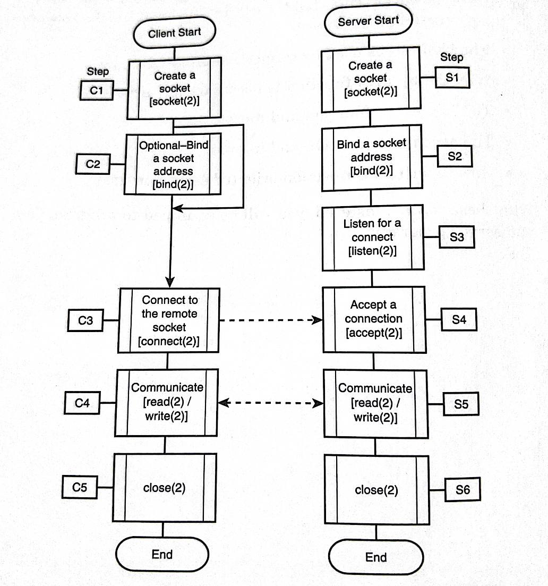
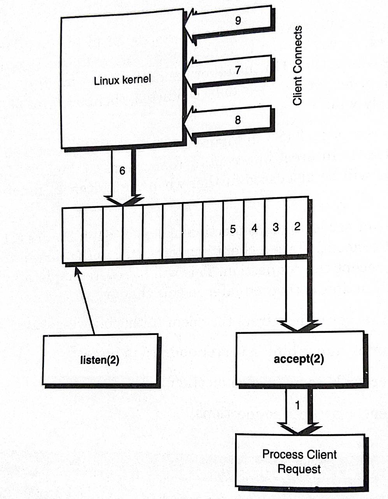
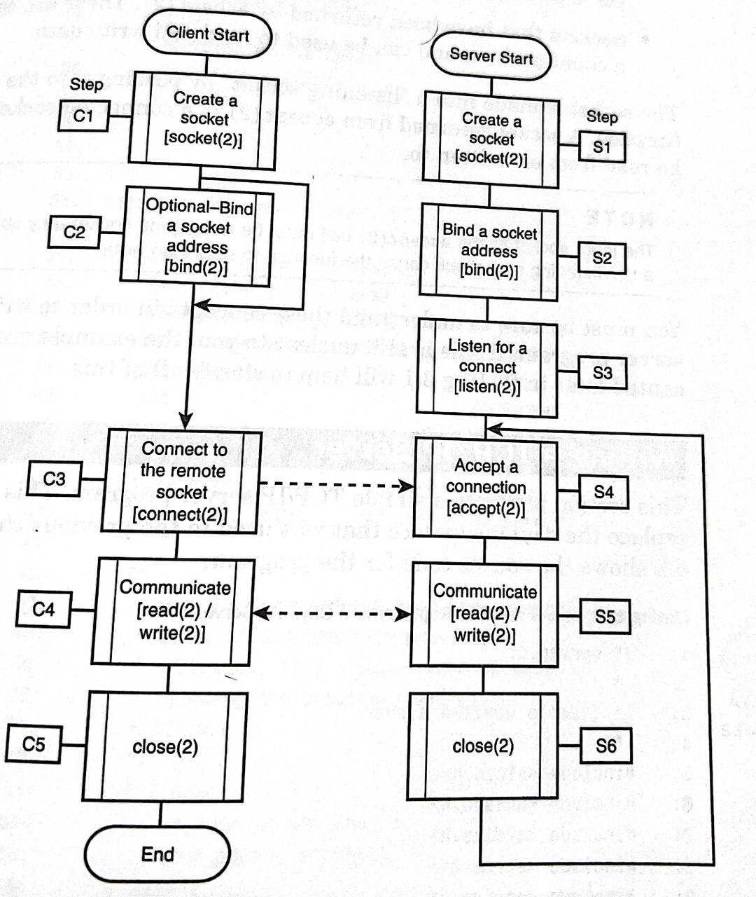

- ## Basic model comparison between client/server
  
  
  So basically, we are listening for a connect in step S3 at the server level, and there is no optional binding. It's mandatory. The server cannot be contacted by the clients unless the client has an address for connecting.
  The process of accepting connections (S4) is a new concept. Once a client has connected to the server, the server must accept the connection.
  
  So briefly, the differences are 
  1. The server must bind a server address to the socket.
  2.  The server listens for a connection.
  3.  The server accepts connections.
	- ### The [[listen(2)]] function
	  This is how the server is able to express its interest in listening for connections.
	  ```c
	         #include <sys/socket.h>
	         /** socket to use as listening socket, backlog -- connect queue in len in entries **/
	         int listen(int sockfd, int backlog);
	  ```
- ### Understanding the Connect Queue
  
  
  The listening block represents the call to listen(2) which establishes a listening queue. A small arrow points up to the queue it established, which resides within the Linux kernel. The length is determined by the backlog argument of the listen call.
  As the first (1) request is processed, we can see more requests coming, being inserted at the tail end of the queue.
  The thrust has been to demonstrate the purpose of the backlog argument, within the function call.
- ### Specifying a Value for backlog
  
  This depends on the server. A small server could use just 5, bigger servers will need a bigger value. 45k connects per hour, need 16.
  If a server can accept concurrent connections, the value should be lower.
- ### The [[accept(2)]] function call, understanding it's role
  ```c
         #include <sys/socket.h>
  /** Input socket sockfd, pointer addr to a socket address structure which will receive the client, and pointer to the maxlen of the receiving socket
  address buffer addr. **/
         int accept(int sockfd, struct sockaddr *restrict addr,
                    socklen_t *restrict addrlen);
  ```
  
  Oddly, the return value from the accept function is a new socket when successful.
  It might seem strange for this function to return another new socket. Why not use the original socket? 
  
  A server, upon accepting one client connection, must be willing to accept any additional ones from clients. Any individual socket, can only be connected to one client.
  
  The following is an improvement of the simplification presented earlier : 
  
  
  As we can see here, the server finishes processing each client's request with a function call, and repeats the steps for each clients that it connects (S4 to S6).
  The server needs its original socket that is able to listen for additional requests to continue receiving new connections.
- #### To summarize..
  
  There are two types of sockets used by the server program :
  -> ==Sockets being used for listening, no reading or writing data to these==
  -> ==Sockets that have been returned by accept(2). These are connected to a client process and can be used to read/write==