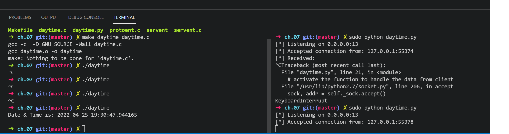

-
- title:: writing a tcp/ip client program
- The only difference with  UDP, is that in UDP we did not have to connect anything. Now , we must use the [[connect(2)]] function.
  
  We only establish the destination address ==once== .
  
  The following code is for an outdated service, connecting to the daytime server on a linux box no longer works cause the inet.d is no longer being used (it was replaced by another daemon manager, systemd) and the local binary is nowhere to be found. If we try to telnet to the daytime service, it's not there and we cant enable it nowhere. Also, systemd is disabled in WSL because of compatibility issues.
  
  We could, theoretically, mock a similar service which just responds a hardcoded string, that way we could imitate the behavior of this service. 
  So I am going to create a simple Python TCP socket server, running on the box, on the same local port.
- # Simple Python mock for daytime service
  ```python
  import socket
  import threading
  import datetime
  
  bind_ip = "0.0.0.0"
  bind_port = 13
  server = socket.socket(socket.AF_INET, socket.SOCK_STREAM)
  server.bind((bind_ip, bind_port))
  server.listen(5)
  print "[*] Listening on %s:%d" % (bind_ip, bind_port)
  # This is the thread we handle the data from  the client
  def handle_client(client_socket):
      # show the data from the client
      # Return a packet
      x = datetime.datetime.now()
      client_socket.send(str(x))
      client_socket.close()
  while True:
      client, addr = server.accept()
      print "[*] Accepted connection from: %s:%d" % (addr[0], addr[1])
      # activate the function to handle the data from client
      client_handler = threading.Thread(target = handle_client, args=(client,))
      client_handler.start()
  
  ```
- # The daytime Client Program
  
  ```c
  /* daytime.c:
   * 
   * Example daytime client :
   */
  #include <stdio.h>
  #include <unistd.h>
  #include <stdlib.h>
  #include <errno.h>
  #include <string.h>
  #include <sys/types.h>
  #include <sys/socket.h>
  #include <netinet/in.h>
  #include <arpa/inet.h>
  #include <netdb.h>
  
  /*
   * This function reports the error and
   * exits back to the shell :
   */
  static void
  bail(const char *on_what) {
      fputs(strerror(errno),stderr);
      fputs(": ",stderr);
      fputs(on_what,stderr);
      fputc('\n',stderr);
      exit(1);
  }
  
  int
  main(int argc,char **argv) {
      int z;
      char *srvr_addr = NULL;
      struct sockaddr_in adr_srvr;/* AF_INET */
      int len_inet;               /* length  */
      int s;                       /* Socket */
      struct servent *sp;   /* Service entry */
      char dtbuf[128];     /* Date/Time info */
  
      /*
       * Use a server address from the command
       * line, if one has been provided.
       * Otherwise, this program will default
       * to using the arbitrary address
       * 127.0.0.1 :
       */
      if ( argc >= 2 ) {
          /* Addr on cmdline: */
          srvr_addr = argv[1];
      } else {
          /* Use default address: */
          srvr_addr = "127.0.0.1";
      }
  
      /*
       * Lookup the daytime tcp service:
       */
      sp = getservbyname("daytime","tcp");
      if ( !sp ) {
          fputs("Unknown service: daytime tcp\n",
              stderr);
          exit(1);
      }
  
      /*
       * Create a server socket address:
       */
      memset(&adr_srvr,0,sizeof adr_srvr);
      adr_srvr.sin_family = AF_INET;
      adr_srvr.sin_port = sp->s_port;
      adr_srvr.sin_addr.s_addr =
          inet_addr(srvr_addr);
  
      if ( adr_srvr.sin_addr.s_addr == INADDR_NONE )
          bail("bad address.");
  
      len_inet = sizeof adr_srvr;
  
      /*
       * Create a TDP/IP socket to use :
       */
      s = socket(PF_INET,SOCK_STREAM,0);
      if ( s == -1 )
          bail("socket()");
  
      /*
       * Connect to the server:
       */
      z = connect(s,&adr_srvr,len_inet);
      if ( z == -1 )
          bail("connect(2)");
  
      /*
       * Read the date/time info:
       */
      z = read(s,&dtbuf,sizeof dtbuf-1);
      if ( z == -1 )
          bail("read(2)");
  
      /*
       * Report the Date & Time :
       */
      dtbuf[z] = 0;   /* null terminate string */
  
      printf("Date & Time is: %s\n",dtbuf);
  
      /*
       * Close the socket and exit:
       */
      close(s);
      putchar('\n');
  
      return 0;
  }
  
  ```
- 
-